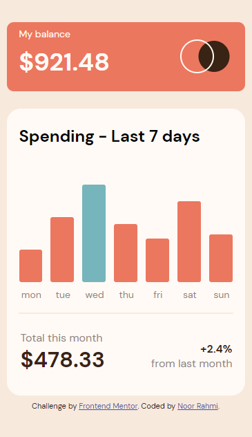

# Frontend Mentor - Expenses chart component solution

This is a solution to the [Expenses chart component challenge on Frontend Mentor](https://www.frontendmentor.io/challenges/expenses-chart-component-e7yJBUdjwt). Frontend Mentor challenges help you improve your coding skills by building realistic projects.

## Table of contents

- [Overview](#overview)
  - [The challenge](#the-challenge)
  - [Screenshot](#screenshot)
  - [Links](#links)
- [My process](#my-process)
  - [What I learned](#what-i-learned)
  - [Built with](#built-with)
  - [Continued development](#continued-development)
  - [Useful resources](#useful-resources)
- [Author](#author)

## Overview

### The challenge

Users should be able to:

- View the bar chart and hover over the individual bars to see the correct amounts for each day
- See the current day’s bar highlighted in a different colour to the other bars
- View the optimal layout for the content depending on their device’s screen size
- See hover states for all interactive elements on the page
- **Bonus**: Use the JSON data file provided to dynamically size the bars on the chart

### Screenshot

### Links

- Solution URL: (https://rahmi1016.github.io/expenses-chart-component-vanilla/)
- Live Site URL: (https://rahmi1016.github.io/expenses-chart-component-vanilla/)

## My process

### What I learned

- need to learn to use json file.
- when using appendChild, completed the parent element first then the child element.

### Built with

- Semantic HTML5 markup
- CSS custom properties
- Flex
- Grid
- Table
- Block

### Continued development

- make the responsive layout styling not "too fixed"
-

### Useful resources

- [Grid Template Column](https://css-tricks.com/almanac/properties/g/grid-template-columns/) - This article help me understand grid-template-column use.
- [JavaScript Date getDay()](https://www.w3schools.com/jsref/jsref_getday.asp) - This helped me got the current day name
- [Making Bar Chart with HTML Table pt.1](https://codepen.io/inegoita/pen/YMrJGY) - This helped me understand how to make bar chart with HTML table
- [Making Bar Chart with HTML Table pt.2](https://codepen.io/Muthukrishnan/pen/vGoZVz) - This helped me understand how to make bar chart with HTML table

## Author

- Frontend Mentor - [@rahmi1016](https://www.frontendmentor.io/profile/rahmi1016)
